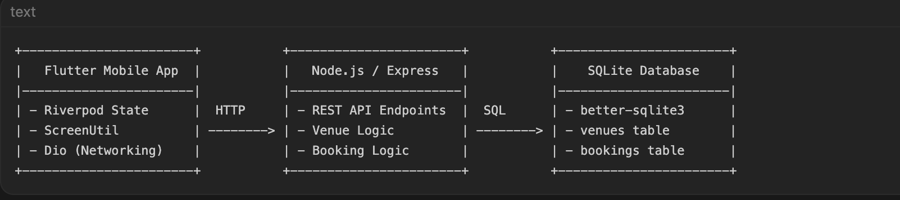
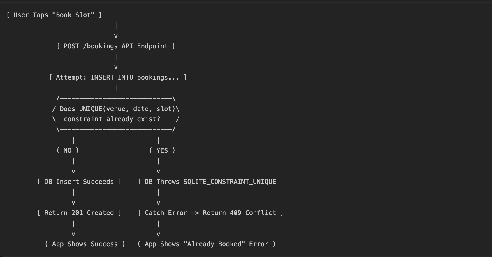

# QuickSlot — Concurrency-Safe Venue Booking App

QuickSlot is a lightweight, responsive, and concurrency-safe full-stack venue booking application built for rapid, reliable booking of sports courts.

## Architecture Overview

The project is structured as a monorepo separated into two main folders:
1. **/server**: Node.js + Express backend with a zero-configuration SQLite database (`better-sqlite3`).
2. **/app**: Flutter mobile client utilizing Riverpod for state management, Freezed/JSON annotation for data models, and ScreenUtil for responsive scaling (mobile and tablet).

### Architecture Sketch
*(See attached whiteboard sketch)*


### Backend Flow Diagram
*(See attached backend flow diagram)*


*(Note: Replace the image placeholders above with the actual photos of your handwritten notebook sketches before submitting).*

---

## Concurrency & Double-Booking Protection

The core constraint of this app is to **never allow double-booking**. If two users try to book the exact same venue slot at the same second, one succeeds and the other receives an in-app error.

### How it is solved:
1. **Database-Level Constraint (DIP/SOLID):** The `bookings` table has a composite `UNIQUE` index constraint: `UNIQUE(venue_id, date, slot)`. This means the database engine itself rejects any duplicate write attempt.
2. **Http Conflict Code Handling (409):** If a database insertion fails due to a unique constraint violation, the Express backend returns a **`409 Conflict`** HTTP response.
3. **Flutter Concurrency Feedback:** The Flutter client catches the `409` status code and prompts a clean failure alert to the second user. It then automatically triggers a refresh of the slots grid to reflect the newly booked state in real-time.

---

## Architectural Decisions & Rationale

During development, critical technical choices were made to optimize speed, maintainability, and demo reliability during the hiring review:

### 1. State Management: Riverpod over BLoC
While BLoC is a robust state management tool, **Riverpod** was chosen for this project because it is simple, highly efficient, and incredibly popular among modern Flutter developers. 
* **Less Boilerplate:** Riverpod eliminates massive boilerplate files (Events, States), allowing for faster feature delivery.
* **Modern Dependency Injection (DI):** We use it to inject the `DioClient` into `VenueApi`, which goes into `VenueRepository`, and finally into `VenueController`.
* **Auto-Disposal:** We utilize Riverpod's `autoDispose` controllers. As soon as the user exits a screen, the state is cleared from memory, preventing memory leaks and stale data.

### 2. Database: SQLite over Postgres / MongoDB (For Hackathon Speed)
SQLite is synchronous and file-based, meaning zero configuration and no network connection pools to configure during the tight hackathon deadline. Because the database operations are decoupled via repository boundaries, scaling to PostgreSQL in production only requires changing the DB driver.

---

## Scope Cuts & Justifications

Following the hackathon guidelines: *"A smaller app that is correct, well-structured, and fully understood beats a feature-stuffed app you can't explain."* I deliberately cut the following scope to focus on core stability:

*   **Full Authentication System:** Instead of building a complex JWT/OAuth flow with local secure storage persistence, I used a simplified hardcoded user approach (`X-User-Id` request header). This allowed me to focus all my time on the core challenge: handling concurrency, state management, and robust UI error boundaries.
*   **Local Caching Database:** Given the real-time nature of bookings and the constraint against double-booking, ensuring fresh data directly from the server was prioritized over complex local caching mechanisms.

---

## Robust UI Error Boundaries

To ensure the application is production-grade, all network, validation, and database errors are handled gracefully in the UI:
1. **Network Disconnects:** Handled using Riverpod's `AsyncValue.when(error: ...)`. Instead of red screens or infinite loading, it shows a clean warning message with a **"Retry"** button.
2. **Double-Booking Conflict (409):** Caught via explicit `try-catch` blocks in the Repository layers, mapping exceptions to user-friendly native dialogs and banners, followed by an immediate data refresh.

---

## AI Usage Note

I utilized AI coding assistants (specifically the Anti-gravity IDE) primarily to accelerate boilerplate generation (like Freezed models and basic Riverpod providers) and to help scaffold the Express/SQLite backend structure rapidly.

**One thing the AI got wrong that I caught and fixed:**
Initially, the AI completely forgot to properly handle error cases and failed to add `try-catch` blocks in the API and Repository layers. This meant that network errors or `409 Conflict` database constraint violations would just crash or fail silently instead of being handled gracefully in the UI. I caught this oversight and figured out the correct approach, directing the architecture to include explicit `try-catch` blocks and custom exception mapping in the `VenueApi` and `BookingApi` classes. Because I figured this out correctly, the Riverpod controllers can now catch specific `ConflictExceptions` precisely where they occur and display the proper UI error banners.

---

## What I'd Do With One More Day

If I had one more day to work on this project, I would implement:
1.  **WebSocket Integration:** To push real-time availability updates to all connected clients instantly when a slot is booked, rather than relying on manual UI refreshes.
2.  **Full JWT Authentication:** Implementing a secure user registration and login flow using Firebase Auth or a custom Node.js JWT strategy.
3.  **Comprehensive E2E Testing:** Expanding beyond unit/widget tests to include full end-to-end (E2E) UI testing using Patrol.

---

## Live API Demonstration (Railway Deployment)

The backend is fully deployed to Railway and the Flutter app successfully communicates with the live server. Here is a direct device log output proving the `GET /venues` request hitting the production server perfectly:

```text
[Request] -> GET https://hackathon-production-bead.up.railway.app/venues
I/flutter (29841): Headers: {X-User-Id: User_A}
I/flutter (29841): 
I/flutter (29841): [Response] -> 200 https://hackathon-production-bead.up.railway.app/venues
I/flutter (29841): Response Body:
I/flutter (29841): [
I/flutter (29841):   {
I/flutter (29841):     "id": 1,
I/flutter (29841):     "name": "Arena Futsal Court",
I/flutter (29841):     "location": "Zone A, Level 1",
I/flutter (29841):     "capacity": 10
I/flutter (29841):   },
I/flutter (29841):   {
I/flutter (29841):     "id": 2,
I/flutter (29841):     "name": "Grand Badminton Hall",
I/flutter (29841):     "location": "Zone B, Level 2",
I/flutter (29841):     "capacity": 4
I/flutter (29841):   },
I/flutter (29841):   {
I/flutter (29841):     "id": 3,
I/flutter (29841):     "name": "Sky Tennis Court",
I/flutter (29841):     "location": "Rooftop, Block C",
I/flutter (29841):     "capacity": 4
I/flutter (29841):   },
I/flutter (29841):   {
I/flutter (29841):     "id": 4,
I/flutter (29841):     "name": "Championship Basketball Court",
I/flutter (29841):     "location": "Zone A, Level 2",
I/flutter (29841):     "capacity": 15
I/flutter (29841):   },
I/flutter (29841):   {
I/flutter (29841):     "id": 5,
I/flutter (29841):     "name": "Premium Squash Court",
I/flutter (29841):     "location": "Zone B, Level 1",
I/flutter (29841):     "capacity": 2
I/flutter (29841):   }
I/flutter (29841): ]
```

---

## Setup & Running Locally

### 1. Start the Node.js Server
Navigate to `/server` and start the watch-server:
```bash
cd server
npm install
npm run dev
```

### 2. Run the Flutter App
Find your Mac's local network IP address (e.g., `192.168.0.114`) and ensure your phone/emulator is on the same Wi-Fi. Update the baseUrl in `app/lib/core/network/dio_client.dart` with your IP, then run the app:
```bash
cd app
flutter pub get
dart run build_runner build --delete-conflicting-outputs
flutter run
```
